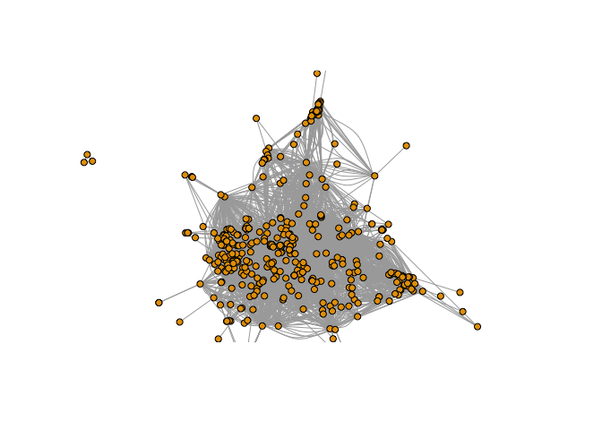

More and more I’ve been working in graphs. Graphs are particularly
useful when you are analyzing connection and community, and can be an
extremely efficient way to store data. Sometimes I’ll use a graph
database to get data just because its faster than a traditional
relational database.

In this post I want to focus on community detection algorithms, which
have a lot of practical uses. They can help identify a structure in a
set of interactions, which has applications to organizational design,
but can also be useful in other fields such as digital communications
and crime investigation - for example, the famous <i>Panama Papers</i>
investigation made major use of graphs and community detection.

What is community detection?
----------------------------

If communities exist inside a network, you’d expect that two nodes (eg
people) who are more closely connected are more likely to be members of
the same community. Working off this principle, a variety of algorithms
exist that iterate through nodes and groups of nodes in networks and try
to form an optimal grouping of the nodes, so that connections inside the
groups are dense and connections between the groups are sparse.

Of course, large networks are complex, and so its usually quite
impossible to find completely separate communities. Communities can
overlap substantially, and algorithms are primarily concerned with
optimizing. Visually, in these situations, it’s common for the end
result to look a bit messy, but the visualization is not the point.
Through performing community detection we get access to valuable
information which can help us take action to improve efficiency. For
example we may institute a formal organization structure whic is more
aligned with the true flow of work, or we might reconfigure server
clusters to speed up information flow.

Game of Thrones network
-----------------------

To illustrate the power of community detection algorithms, I’m going to
take the network of all character interactions in Game of Thrones,
Seasons 1-8, and see what communities I can find. I’ve never watched the
show, so have no idea how intuitive the results will be - maybe some
readers can give a point of view after they’ve seen the results.

In this network, any two characters are connected if they have appeared
in the same scene, and the strength of the connection is determined by
the number of scenes they have appeared together in.

First - let’s build the network. Many thanks to Github user
mathbeveridge who has created edgelists for the network for each season
here:
<a href="https://github.com/mathbeveridge/gameofthrones/tree/master/data" class="uri">https://github.com/mathbeveridge/gameofthrones/tree/master/data</a>.
I’m going to just grab these edgelists straight from github and build
them into one compiled edgelist to create the network using the `igraph`
package in R.

    library(tidyverse)
    library(readr)
    library(igraph)

    # get s1 edgelist

    edgefile_url <- "https://raw.githubusercontent.com/mathbeveridge/gameofthrones/master/data/got-s1-edges.csv"
    edgelist <- readr::read_csv(edgefile_url)

    # append edglistists for s2-8
    for (i in 2:8) {
      edgefile_url <- paste0("https://raw.githubusercontent.com/mathbeveridge/gameofthrones/master/data//got-s", i, "-edges.csv")
      edges <- readr::read_csv(edgefile_url) 
      edgelist <- edgelist %>% 
        dplyr::bind_rows(edges)
    }

    seasons <- 1:8 # <- adjust if you want to focus on specific seasons

    edgelist <- edgelist %>% 
      dplyr::filter(Season %in% seasons)

    # create igraph network with weighted edges

    edgelist_matrix <- as.matrix(edgelist[ ,1:2])

    got_graph <- igraph::graph_from_edgelist(edgelist_matrix, directed = FALSE) %>% 
      igraph::set.edge.attribute("weight", value = edgelist$Weight)

OK, we’ve built our GoT network. Easy as that. Let’s take a quick look
at it.

    l <- igraph::layout_with_mds(got_graph)
    plot(got_graph, vertex.label = NA, vertex.size = 5, rescale = F, layout = l*0.02)

This looks like a pretty busy graph with lots of connections, and it’s
hard to discern any meaningful or helpful structure to it. But it won’t
take long for us to fix that.

Using the Louvain community detection algorithm
-----------------------------------------------

The Louvain community detection algorithm is a well-regarded algorithm
for creating optimal community structures in complex networks. It is not
the only one available (a fairly new algorithm called the Leiden
algorithm is thought to perform slightly better), but there is an easy
implementation of the Louvain algorithm in the `igraph` package, and so
we can run the community detection with a fast, single line command. So
let’s do that and assign all our nodes to their respective community,
and see what size our communities are

    # run louvain with edge weights

    louvain_partition <- igraph::cluster_louvain(got_graph, weights = E(got_graph)$weight)

    got_graph$community <- louvain_partition$membership

    sizes(louvain_partition) %>% 
      knitr::kable()

<table>
<thead>
<tr class="header">
<th style="text-align: left;">Community.sizes</th>
<th style="text-align: right;">Freq</th>
</tr>
</thead>
<tbody>
<tr class="odd">
<td style="text-align: left;">1</td>
<td style="text-align: right;">56</td>
</tr>
<tr class="even">
<td style="text-align: left;">2</td>
<td style="text-align: right;">38</td>
</tr>
<tr class="odd">
<td style="text-align: left;">3</td>
<td style="text-align: right;">95</td>
</tr>
<tr class="even">
<td style="text-align: left;">4</td>
<td style="text-align: right;">86</td>
</tr>
<tr class="odd">
<td style="text-align: left;">5</td>
<td style="text-align: right;">75</td>
</tr>
<tr class="even">
<td style="text-align: left;">6</td>
<td style="text-align: right;">5</td>
</tr>
<tr class="odd">
<td style="text-align: left;">7</td>
<td style="text-align: right;">3</td>
</tr>
<tr class="even">
<td style="text-align: left;">8</td>
<td style="text-align: right;">49</td>
</tr>
</tbody>
</table>

So we have a couple of very small communities here - lets take a look at
who is in these.

    membership(louvain_partition)[which(membership(louvain_partition) %in% c(6,7))] 

    ##   BALON_DWARF    ROBB_DWARF   RENLY_DWARF STANNIS_DWARF JOFFREY_DWARF 
    ##             6             6             6             6             6 
    ##    BLACK_JACK          KEGS         MULLY 
    ##             7             7             7

So a quick bit of online research suggests that these are one-off
communities that appear in very specific episodes of GoT and who
interact almost entirely with each other - the five dwarfs do a role
play of the five kinfs in Season 4, and the trio on Black Jack, Kegs and
Mully also appear in that same season. While it’s reassuring that these
peripheral communities are being identified, its probably not helpful to
consider them in the main questions we are looking at here, so I’ll keep
them to one side as we proceed.

Characterizing the main communities
-----------------------------------

We will want to find a way to characterize our main communities. One way
of doing that is to identify important nodes in each community -
characters how are important in the overall connectedness of that
community.

First we could find the nodes that have the most connection to other
nodes inside each community. Let’s do that, by creating subgraphs of
each community, and iterating a vector that contains the names of the
nodes with the highest degree in each community.

    high_degree_nodes <- c()

    for (i in 1:8) {
      subgraph <- induced_subgraph(got_graph, v = which(got_graph$community == i))
      degree <-  igraph::degree(subgraph)
      high_degree_nodes[i] <- names(which(degree == max(degree)))
    }

    high_degree_nodes[c(1:5, 8)]

    ## [1] "DAENERYS" "SANSA"    "CERSEI"   "JON"      "THEON"    "ARYA"

So we can see the six most connected characters are, unsurprisingly,
leading characters, and they help us characterize the communities we
have detected. We could also try to characterize each community by the
node that is the best connector of other nodes - a measure called
betweenness centrality.

    high_btwn_nodes <- c()

    for (i in 1:8) {
      subgraph <- induced_subgraph(got_graph, v = which(got_graph$community == i))
      btwn <-  igraph::betweenness(subgraph)
      high_btwn_nodes[i] <- names(which(btwn == max(btwn)))
    }

    high_btwn_nodes[c(1:5, 8)]

    ## [1] "JORAH"  "SANSA"  "TYRION" "SAM"    "ROBB"   "ARYA"

We can see that for a couple of communities the central character is the
same with this measure, but for the rest it is different - which may
help further characterize the community.

Visualizing the communities
---------------------------

It’s often helpful for people to look at a network, although for a
network of this size that can be quite complex. By color coding the
nodes and edges in the communities, we can better differentiate them,
and we can then also label the nodes of the most central characters.
Another option is to scale the nodes size to the importance of the node
in the overall network.

First we can generate a pretty sphere network.

    # give our nodes some properties, incl scaling them by degree and coloring them by community

    V(got_graph)$size <- degree(got_graph)/10
    V(got_graph)$frame.color <- "white"
    V(got_graph)$color <- got_graph$community
    V(got_graph)$label <- V(got_graph)$name

    # also solor edges according to their starting node
    edge.start <- ends(got_graph, es = E(got_graph), names = F)[,1]
    E(got_graph)$color <- V(got_graph)$color[edge.start]
    E(got_graph)$arrow.mode <- 0

    # only label central characters

    v_labels <- which(V(got_graph)$name %in% high_degree_nodes[c(1:5, 8)])

    for (i in 1:length(V(got_graph))) {
      if (!(i %in% v_labels)) {
        V(got_graph)$label[i] <- ""
      }
    }

    # plot network
    l1 <- layout_on_sphere(got_graph)
    plot(got_graph, rescale = F, layout = l1)

This is pretty, but not helpful in visualizing the separate communities.
For this it’s better to use a multi-dimensional scaling, to ensure that
more distant nodes are less connected.

    l2 <- layout_with_mds(got_graph)
    plot(got_graph, rescale = F, layout = l2*0.02)

Nice! Of course there is a lot more we can do here to analyze and
characterize the communities, but I wanted you to see that its pretty
easy to implement this type of analysis in a few lines of code, and the
ability of these algorithms to detech genuine communities is quite
something! I’d encourage you to think about uses for this type of
technology in your work or study. Do drop a comment if you can think of
good uses for this.
